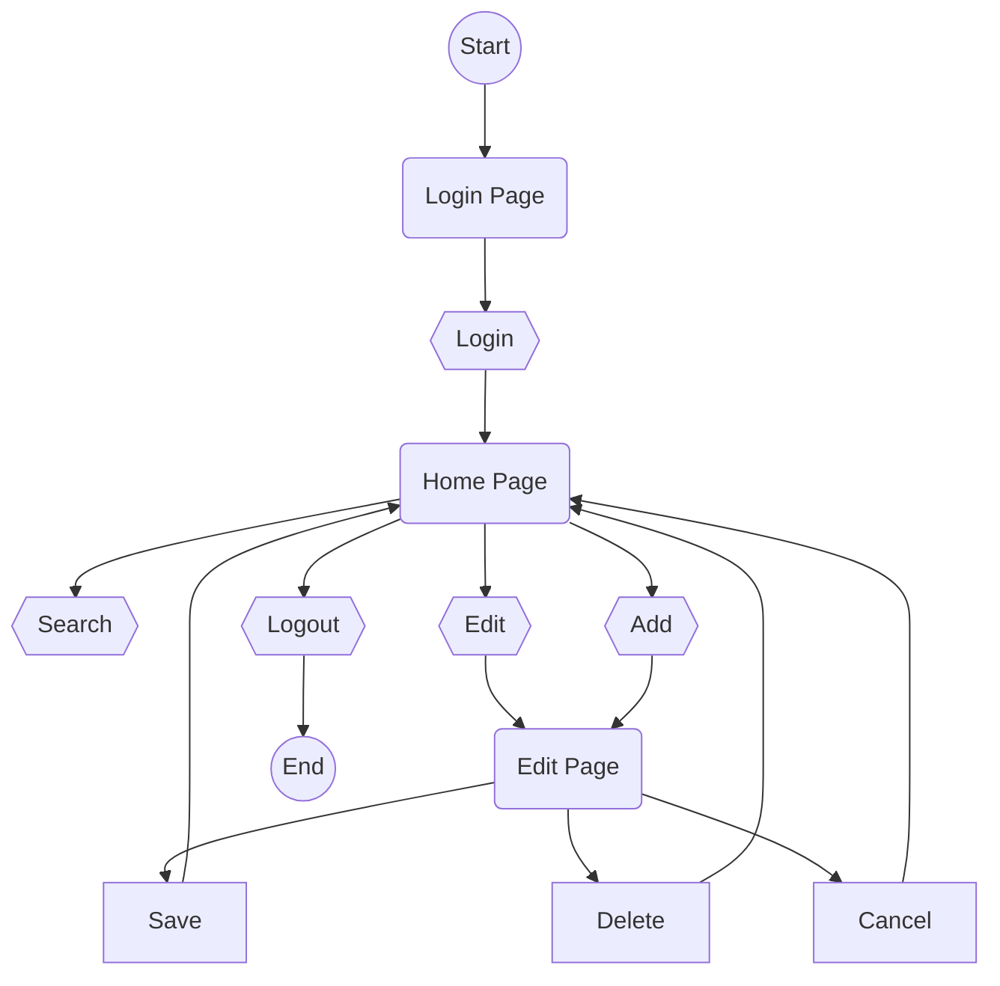

## Simple flow of the user journey

Circles are start and stop of the flow.

Rounded boxes are pages in UI.

Hexagons present actions.

Arrows are relations between pages and actions.

```mermaid
flowchart TD;
    Start((Start))
    LoginPage(Login Page)
    HomePage(Home Page)
    EditPage(Edit Page)
    End((End))

    Login{{Login}}
    Search{{Search}}
    Edit{{Edit}}
    Add{{Add}}
    Save[Save]
    Delete[Delete]
    Cancel[Cancel]
    Logout{{Logout}}

    Start --> LoginPage --> Login

    Login --> HomePage

    HomePage --> Search
    HomePage --> Edit --> EditPage
    HomePage --> Add --> EditPage
    EditPage --> Save
    EditPage --> Delete --> HomePage
    EditPage --> Cancel --> HomePage
    Save --> HomePage
    HomePage --> Logout --> End


```